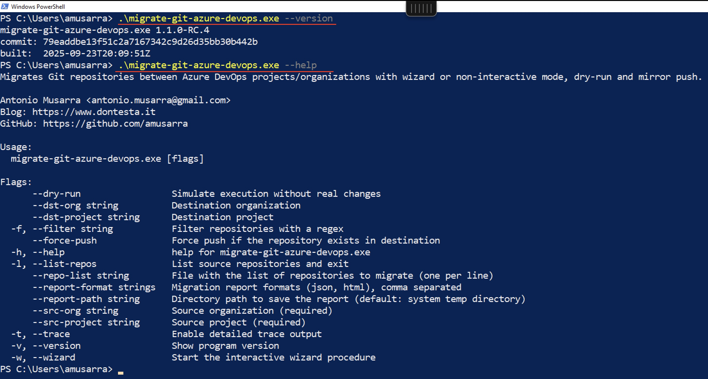
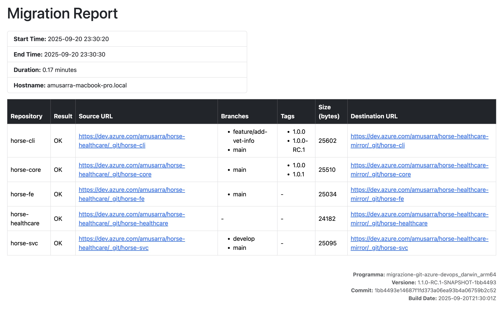

# Azure DevOps Git Repository Migration Tool between Projects/Organizations


Go CLI to migrate Git repositories between Azure DevOps projects/organizations:

- interactive (wizard) or non-interactive (flags) mode
- full mirror (branches/tags, with removal of deleted refs)
- filters (regex) and list file
- dry-run and trace

Credential requirements:

- SRC_PAT: Personal access token with "Code Read" scope
- DST_PAT: Personal access token with "Code Read, Write & Manage" scope (required for migration)

> Note: to generate PATs with the necessary permissions, see the [Microsoft documentation](https://learn.microsoft.com/en-us/azure/devops/organizations/accounts/use-personal-access-tokens-to-authenticate)

Below is an example of the tool in action.

[](https://asciinema.org/a/741276?t=0:12)

## Quickstart

- The first step is to create two PATs (Personal Access Tokens) with the required permissions and export them as environment variables:

  ```bash
  export SRC_PAT="<Source_PAT_Code_Read>"
  export DST_PAT="<Destination_PAT_Code_RW_Manage>"
  ```

- How to get the list of repositories in the source:

  ```bash
  migrate-git-azure-devops --src-org <src-org> --src-project <src-proj> --list-repos

  # abbreviations:
  # migrate-git-azure-devops -so <src-org> -sp <src-proj> --list-repos
  ```

- How to start migration using the interactive wizard (recommended for first migration):

  ```bash
  migrate-git-azure-devops -so <src-org> -sp <src-proj> -do <dst-org> -dp <dst-proj> --wizard
  ```

- How to start migration using non-interactive mode (regex):

  ```bash
  migrate-git-azure-devops -so <src-org> -sp <src-proj> \
    -do <dst-org> -dp <dst-proj> \
    -f '^horse-.*$'
  ```

- How to run Dry-run (simulation, no changes):

  ```bash
  migrate-git-azure-devops -so <src-org> -sp <src-proj> -do <dst-org> -dp <dst-proj> \
    -f '^horse-.*$' --dry-run
  ```

- How to force push to repositories that already exist in the destination:

  ```bash
  migrate-git-azure-devops -so <src-org> -sp <src-proj> -do <dst-org> -dp <dst-proj> \
    -f '^horse-.*$' --force-push
  ```

## CLI Usage

Main flags:

- `--src-org`, `-so`: source organization
- `--src-project`, `-sp`: source project
- `--dst-org`, `-do`: destination organization
- `--dst-project`, `-dp`: destination project
- `--filter`, `-f`: regex for repositories to migrate (e.g.: '^horse-.*$')
- `--repo-list`, `-rl`: file with list of repo names (one per line, "#" for comments)
- `--dry-run`: does not make changes, only shows actions
- `--force-push`, `-fp`: force mirror push to already existing repos
- `--trace`, `-t`: debug output; also shows HTTP response body on error
- `--list-repos`: lists source repositories and exits
- `--wizard`: interactive mode
- `-h`, `--help`: help

Examples:

- List repos:

  ```bash
  migrate-git-azure-devops -so myorg -sp MyProject --list-repos
  ```

- Migration with regex:
  
  ```bash
  migrate-git-azure-devops -so srcorg -sp Src -do dstorg -dp Dst -f '^horse-(core|svc)-.*$'
  ```

- Migration from list file:

  ```plaintext
  # File with the list of repositories to migrate (one per line, "#" for comments)
  horse-core
  horse-svc
  horse-cli
  ```

  ```bash
  migrate-git-azure-devops -so srcorg -sp Src -do dstorg -dp Dst --repo-list repo.txt
  ```

Output and report:

- At the end, a migration summary table is printed: Repository, Result, Azure URL.
- In case of API errors:
  - "[API ERROR] HTTP {{code}}" is shown
  - in `--trace` mode, the response body is also shown
- HTTP redirects (3xx) are not followed: if the PAT is incorrect you may see 302 instead of a 200 with an HTML page.

## Installation

Several options are available to install the tool.

> Make sure you have Go 1.22+ installed and GOPATH/bin in your PATH as well as git for local build.

Option A) From source (Go 1.22+)

```bash
# Install via 'go install'
# The binary will be $GOPATH/bin/migrate-git-azure-devops
go install github.com/amusarra/migrate-git-azure-devops/cmd/migrate-git-azure-devops@latest
```

Option B) Local build

```bash
git clone https://github.com/amusarra/migrazione-git-azure-devops.git
cd migrate-git-azure-devops
go build -o bin/migrate-git-azure-devops ./cmd/migrate-git-azure-devops
```

Option C) From release (precompiled binaries)

- Go to the Release page: <https://github.com/amusarra/migrazione-git-azure-devops/releases>
- Download the package for your platform (tar.gz or .zip)
  - Linux AMD64: migrazione-git-azure-devops_x.y.z_linux_amd64.tar.gz
  - Linux ARM64: migrazione-git-azure-devops_x.y.z_linux_arm64.tar.gz
  - macOS Apple Silicon: migrazione-git-azure-devops_x.y.z_darwin_arm64.tar.gz
  - macOS Intel: migrazione-git-azure-devops_x.y.z_darwin_amd64.tar.gz
  - Windows AMD64: migrazione-git-azure-devops_x.y.z_windows_amd64.zip
  - Windows ARM64: migrazione-git-azure-devops_x.y.z_windows_arm64.zip

> In the commands below, replace `x.y.z` with the desired version (e.g. `1.0.0-RC.4`).

System installation on Unix-like environments (requires sudo and /usr/local/bin to exist):

```bash
# Linux AMD64
TMP="$(mktemp -d)"
curl -L -o "$TMP/migrazione-git-azure-devops_linux_amd64.tar.gz" \
  "https://github.com/amusarra/migrazione-git-azure-devops/releases/download/x.y.z/migrazione-git-azure-devops_x.y.z_linux_amd64.tar.gz"
tar -xzf "$TMP/migrazione-git-azure-devops_linux_amd64.tar.gz" -o -C "$TMP"
sudo install -m 0755 "$TMP/migrazione-git-azure-devops_linux_amd64" /usr/local/bin/migrate-git-azure-devops
```

```bash
# macOS Apple Silicon (arm64)
TMP="$(mktemp -d)"
curl -L -o "$TMP/migrazione-git-azure-devops_darwin_arm64.tar.gz" \
  "https://github.com/amusarra/migrazione-git-azure-devops/releases/download/x.y.z/migrazione-git-azure-devops_x.y.z_darwin_arm64.tar.gz"
tar -xzf "$TMP/migrazione-git-azure-devops_darwin_arm64.tar.gz" -o -C "$TMP"
sudo install -m 0755 "$TMP/migrazione-git-azure-devops_darwin_arm64" /usr/local/bin/migrate-git-azure-devops
```

System installation on Windows (PowerShell, copy to $HOME).

```bash
# Windows (PowerShell)
$TMP = New-Item -ItemType Directory -Path (Join-Path $env:TEMP (New-Guid))
Invoke-WebRequest -Uri "https://github.com/amusarra/migrazione-git-azure-devops/releases/download/x.y.z/migrazione-git-azure-devops_x.y.z_windows_amd64.zip" -OutFile "$TMP/migrazione-git-azure-devops.zip"
Expand-Archive -Path "$TMP/migrazione-git-azure-devops.zip" -DestinationPath "$TMP"
Copy-Item -Recurse -Force "$TMP/migrazione-git-azure-devops_windows_amd64.exe" "$HOME/migrazione-git-azure-devops.exe"
```

Optional: verify checksum (download checksums.txt from the release and verify the hash).

After installation, verify the version:

```bash
# Run on Unix-like (Linux, macOS)
migrate-git-azure-devops --version

# Run on Windows (PowerShell) from $HOME
.\migrazione-git-azure-devops.exe --version

# Example output:
migrate-git-azure-devops 1.0.0-RC.4
commit: 19dd541501d82a0d6fc274a01538ee67db6ff8ee
built:  2025-09-17T15:51:04Z
```

The image below shows the output of `--version` and `--help` on a Microsoft Windows system.



### Notes for Windows users

- If using PowerShell, you may need to change the [Execution Policy](https://learn.microsoft.com/en-us/powershell/module/microsoft.powershell.core/about/about_execution_policies) to run downloaded scripts (e.g. `Set-ExecutionPolicy RemoteSigned -Scope CurrentUser`).
- Windows Defender SmartScreen may block execution of the downloaded tool. In this case, right-click the `.exe` file, select "Properties" and then "Unblock" to allow execution (see image below).


SmartScreen blocks the file because the `.exe` is not signed with a certificate recognized by Microsoft. The binary was signed with a self-signed certificate (not recognized by Microsoft). Refer to the release GitHub Action for details. Below is an example of how to view the self-signed certificate used to sign the Windows binary.


## Build and Release (for maintainers)

Snapshot with GoReleaser (artifacts in dist/).

> Make sure you have GoReleaser installed (<https://goreleaser.com/install/>).

```bash
goreleaser release --clean --snapshot --skip=publish
```

Native build

```bash
go build -o bin/migrate-git-azure-devops ./cmd/migrate-git-azure-devops
```

CI (GitHub Actions)

- Lint with golangci-lint (see `.github/workflows/build.yml`)
- GoReleaser in snapshot mode uploads artifacts as workflow artifacts.
- The full release (without --snapshot) generates changelog and publishes artifacts (see `.github/workflows/release.yml`).

## Migration Report Feature

The tool can generate a detailed migration report in **JSON** and/or **HTML** format. This feature is useful for audit, troubleshooting, and documentation of performed activities.

> This feature is available from version 1.1.0

### How to enable the report

Add the `--report-format` flag to choose one or more formats (e.g. `--report-format json,html`).  
Specify the destination directory with `--report-path` (must exist), otherwise the report is saved in the system temporary directory.

Example:

```bash
migrate-git-azure-devops ... --report-format html,json --report-path /path/to/save
```

### Information included in the report

The report includes:

- Migration start and end date/time
- Total duration (in minutes)
- Hostname of the machine where migration was executed
- Detailed list of migrated repositories with:
  - Repository name
  - Result (OK, error, skipped, dry-run)
  - Source and destination URLs
  - Number and names of migrated branches
  - Number and names of migrated tags
  - Repository size in bytes

Below is an example of HTML output.



Below is an example of JSON output.

```json
{
  "StartTime": "2024-06-01T10:00:00Z",
  "EndTime": "2024-06-01T10:05:12Z",
  "Duration": 5.2,
  "Hostname": "myhost.local",
  "Summaries": [
    {
      "Repo": "horse-core",
      "Result": "OK",
      "DstWebURL": "https://dev.azure.com/org/proj/_git/horse-core",
      "SrcWebURL": "https://dev.azure.com/org/proj/_git/horse-core",
      "NumBranches": 3,
      "BranchNames": ["main", "develop", "feature-x"],
      "NumTags": 2,
      "TagNames": ["v1.0.0", "v1.1.0"],
      "Size": 1234567
      // ...other fields...
    }
    // ...
  ],
  "ProgramName": "migrazione-git-azure-devops_darwin_arm64",
  "Version": "1.1.0-RC.2-SNAPSHOT-77c0913",
  "Commit": "77c0913783f61032286916860bda6996f7291474",
  "BuildDate": "2025-09-23T12:12:06Z"
}
```

### Notes

- The report file name contains a timestamp to ensure uniqueness.
- If the directory specified with `--report-path` does not exist, the tool shows an error.
- Both formats can be generated simultaneously.

## Notes and Tips

- PAT:
  - SRC_PAT always required (even for `--list-repos`)
  - DST_PAT required when specifying the destination (migration)
- Trace:
  - enables "[TRACE] ..." with requested URLs
  - prints the HTTP response body on error
- Dry-run:
  - no changes on Azure DevOps side
  - useful to verify filters/list and actions to be performed
- Force-push:
  - overwrites the state of the destination repo (mirror + --force if it already exists)
